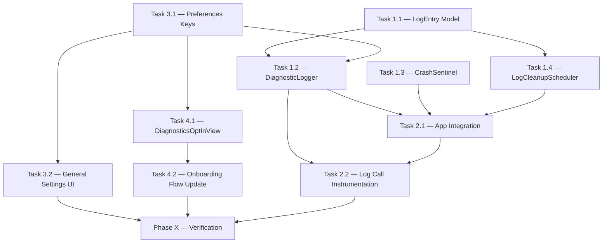

# PLAN: Bug Report Logging System

## Overview

Implement a lightweight crash-reporting and behavior-logging system for Snapzy. When the app crashes (abnormal termination), the next launch presents a dismissable prompt allowing the user to submit the log file via a website. Logs capture **crashes/errors**, **user actions** (screenshot, recording, crop, etc.), and **system context** (macOS version, screen count, memory). Logs are stored as daily `.txt` files that auto-rotate, with entries older than 2 hours automatically purged. Users can enable/disable logging from Preferences and during Onboarding.

**Project Type:** macOS native (Swift / SwiftUI)
**Primary Agent:** `mobile-developer` (macOS native app)

---

## Success Criteria

| #   | Criteria                                                                  | Measurable                                                       |
| --- | ------------------------------------------------------------------------- | ---------------------------------------------------------------- |
| 1   | Crashes, errors, and user actions are logged to daily `.txt` files        | Log file exists at `~/Library/Logs/Snapzy/snapzy_YYYY-MM-DD.txt` |
| 2   | System context (OS version, screens, memory) is recorded at session start | First line of each session block in log                          |
| 3   | Log entries older than 2 hours are automatically pruned                   | File size stays minimal; old entries disappear                   |
| 4   | After a crash, re-launch shows a dismissable bug report prompt            | Alert appears only when crash flag is set                        |
| 5   | "Submit" opens `zapshot.app/bug-report` in default browser                | URL opens correctly in Safari/Chrome                             |
| 6   | User can export/attach the `.txt` log file                                | Reveal in Finder or copy path works                              |
| 7   | Preferences → General has a toggle to enable/disable logging              | Toggle persists via UserDefaults                                 |
| 8   | Onboarding includes a "Diagnostics" step with opt-in (default enabled)    | New step visible between Permissions and Shortcuts               |
| 9   | All files rotate daily and old daily files are cleaned up                 | Only today's file exists after cleanup                           |

---

## Tech Stack

| Technology                     | Rationale                                                              |
| ------------------------------ | ---------------------------------------------------------------------- |
| Swift `os.Logger` / `OSLog`    | Native, zero-dependency structured logging with minimal overhead       |
| `FileManager`                  | File I/O for `.txt` log writing and cleanup                            |
| `UserDefaults` + `@AppStorage` | Consistent with existing preferences pattern                           |
| `NSAlert`                      | Consistent with existing crash/license alert patterns in `AppDelegate` |
| `ProcessInfo` / `sysctl`       | System context (OS version, physical memory, CPU)                      |
| `NSScreen`                     | Screen count and resolution                                            |

---

## File Structure

```
Snapzy/
├── Core/
│   └── Diagnostics/                          ← NEW directory
│       ├── DiagnosticLogger.swift             ← Core logging engine
│       ├── DiagnosticLogEntry.swift           ← Log entry model + formatter
│       ├── CrashSentinel.swift                ← Crash detection (flag-based)
│       └── LogCleanupScheduler.swift          ← 2-hour rolling cleanup + daily rotation
├── Features/
│   ├── Preferences/
│   │   ├── PreferencesKeys.swift              ← MODIFY (add diagnostics keys)
│   │   └── Tabs/
│   │       └── GeneralSettingsView.swift      ← MODIFY (add Diagnostics section)
│   ├── Onboarding/
│   │   └── Views/
│   │       └── DiagnosticsOptInView.swift     ← NEW onboarding step
│   └── Splash/
│       └── SplashOnboardingRootView.swift     ← MODIFY (add diagnostics step)
├── App/
│   └── SnapzyApp.swift                        ← MODIFY (init logger, crash sentinel, cleanup, alert)
```

---

## Task Breakdown

### Phase 1: Core Diagnostics Engine

> Foundation — no UI, just the logging infrastructure.

---

#### Task 1.1 — `DiagnosticLogEntry.swift`

**Agent:** `mobile-developer` | **Skill:** `clean-code`

| Field      | Value                                                                 |
| ---------- | --------------------------------------------------------------------- |
| **INPUT**  | Log level enum, event category, message format                        |
| **OUTPUT** | `DiagnosticLogEntry` struct with `.toLogLine()` → compact text        |
| **VERIFY** | Calling `.toLogLine()` produces `[HH:mm:ss][LEVEL][CATEGORY] message` |

**Design:**

```
Log levels: .info, .warning, .error, .crash
Categories: .system, .capture, .recording, .editor, .ui, .license, .lifecycle
Format:  [14:32:05][INF][CAPTURE] Screenshot taken — fullscreen, display 1
```

- Each line is **one text line** — no multiline entries
- Timestamp is **HH:mm:ss** (no date — the filename already has the date)
- Level is 3-char abbreviated: `INF`, `WRN`, `ERR`, `CRS`
- Category is uppercase tag

##### [NEW] [DiagnosticLogEntry.swift](file:///Users/duongductrong/Developer/ZapShot/Snapzy/Core/Diagnostics/DiagnosticLogEntry.swift)

---

#### Task 1.2 — `DiagnosticLogger.swift`

**Agent:** `mobile-developer` | **Skill:** `clean-code`

| Field      | Value                                                                                            |
| ---------- | ------------------------------------------------------------------------------------------------ |
| **INPUT**  | Singleton logger, log directory, enable/disable flag                                             |
| **OUTPUT** | `.log(_:category:message:)` writes to daily `.txt` file                                          |
| **VERIFY** | After calling `.log()`, file at `~/Library/Logs/Snapzy/snapzy_2026-02-16.txt` contains the entry |

**Design:**

- **Singleton:** `DiagnosticLogger.shared`
- **Log directory:** `~/Library/Logs/Snapzy/` (standard macOS location)
- **File naming:** `snapzy_YYYY-MM-DD.txt`
- **Write strategy:** `FileHandle` append-mode (no full-file rewrite per entry)
- **Thread safety:** `DispatchQueue` serial queue for writes
- **Enable check:** Reads `UserDefaults` key `diagnostics.enabled` — if `false`, all `.log()` calls are no-ops
- **Session header:** On first write of a session, log system context:
  ```
  === SESSION START 2026-02-16 14:32:05 ===
  macOS 15.3 | Snapzy 1.2.0 (42) | 16GB RAM | 2 screens (2560x1440, 1920x1080)
  ================================================
  ```

##### [NEW] [DiagnosticLogger.swift](file:///Users/duongductrong/Developer/ZapShot/Snapzy/Core/Diagnostics/DiagnosticLogger.swift)

---

#### Task 1.3 — `CrashSentinel.swift`

**Agent:** `mobile-developer` | **Skill:** `clean-code`

| Field      | Value                                                                                          |
| ---------- | ---------------------------------------------------------------------------------------------- |
| **INPUT**  | Flag-based crash detection using UserDefaults                                                  |
| **OUTPUT** | `didCrashLastSession` boolean, `markLaunched()`, `markTerminated()`                            |
| **VERIFY** | If app force-quits without `markTerminated()`, next launch reads `didCrashLastSession == true` |

**Design:**

- On launch: call `markLaunched()` → sets `diagnostics.sessionActive = true`
- On clean termination (`applicationWillTerminate`): call `markTerminated()` → sets `diagnostics.sessionActive = false`
- On next launch: if `diagnostics.sessionActive == true` → previous session crashed
- After reading crash state, reset the flag

##### [NEW] [CrashSentinel.swift](file:///Users/duongductrong/Developer/ZapShot/Snapzy/Core/Diagnostics/CrashSentinel.swift)

---

#### Task 1.4 — `LogCleanupScheduler.swift`

**Agent:** `mobile-developer` | **Skill:** `clean-code`

| Field      | Value                                                                                           |
| ---------- | ----------------------------------------------------------------------------------------------- |
| **INPUT**  | Log directory path, 2-hour TTL                                                                  |
| **OUTPUT** | Removes log entries older than 2 hours from today's file; deletes old daily files               |
| **VERIFY** | After cleanup, today's file only has entries from the last 2 hours; yesterday's file is deleted |

**Design:**

- **Entry-level cleanup:** Read today's log file, parse timestamps, rewrite file keeping only entries within the last 2 hours
- **File-level cleanup:** Delete any `snapzy_*.txt` files that are not today's date
- **Scheduling:** Run cleanup on app launch + every 30 minutes via `Timer`
- **Lightweight:** Only operates on text files, no heavy processing

##### [NEW] [LogCleanupScheduler.swift](file:///Users/duongductrong/Developer/ZapShot/Snapzy/Core/Diagnostics/LogCleanupScheduler.swift)

---

### Phase 2: App Integration

> Wire the diagnostics engine into the app lifecycle and existing features.

---

#### Task 2.1 — Integrate into `SnapzyApp.swift`

**Agent:** `mobile-developer` | **Skill:** `clean-code`

| Field      | Value                                                                            |
| ---------- | -------------------------------------------------------------------------------- |
| **INPUT**  | Existing `AppDelegate.applicationDidFinishLaunching`                             |
| **OUTPUT** | Logger initialized, crash sentinel checked, cleanup scheduled, crash alert shown |
| **VERIFY** | App launches → log file created → crash sentinel set → cleanup timer running     |

**Changes:**

1. In `applicationDidFinishLaunching`:
   - Call `CrashSentinel.shared.checkAndReset()` → returns `didCrash: Bool`
   - Call `DiagnosticLogger.shared.startSession()` → writes session header
   - Call `LogCleanupScheduler.shared.start()`
   - If `didCrash && diagnosticsEnabled` → show crash report `NSAlert` (after splash dismisses)

2. Add `applicationWillTerminate`:
   - Call `CrashSentinel.shared.markTerminated()`
   - Call `DiagnosticLogger.shared.log(.info, .lifecycle, "App terminated normally")`

3. **Crash alert design:**
   - Title: "Snapzy quit unexpectedly"
   - Body: "A diagnostic log was saved. You can submit it to help us fix the issue."
   - Button 1: "Submit Bug Report" → opens `https://zapshot.app/bug-report` + reveals log file in Finder
   - Button 2: "Dismiss" → continues normally

##### [MODIFY] [SnapzyApp.swift](file:///Users/duongductrong/Developer/ZapShot/Snapzy/App/SnapzyApp.swift)

---

#### Task 2.2 — Sprinkle log calls across existing features

**Agent:** `mobile-developer` | **Skill:** `clean-code`

| Field      | Value                                                                             |
| ---------- | --------------------------------------------------------------------------------- |
| **INPUT**  | Key user-action points across the codebase                                        |
| **OUTPUT** | `.log()` calls at strategic points                                                |
| **VERIFY** | Performing actions (screenshot, recording, etc.) produces entries in the log file |

**Key logging points:**

| File                             | Event                | Log                                                |
| -------------------------------- | -------------------- | -------------------------------------------------- |
| `ScreenCaptureManager.swift`     | Screenshot captured  | `[INF][CAPTURE] Screenshot — {type}, display {id}` |
| `ScreenRecordingManager.swift`   | Recording start/stop | `[INF][RECORDING] Started/Stopped — {duration}s`   |
| `KeyboardShortcutManager.swift`  | Shortcut triggered   | `[INF][UI] Shortcut: {name}`                       |
| `PostCaptureActionHandler.swift` | After-capture action | `[INF][CAPTURE] Action: {action}`                  |
| `LicenseManager.swift`           | License validation   | `[INF][LICENSE] Validation: {result}`              |

> [!IMPORTANT]
> Keep log calls **minimal and non-intrusive**. One line per event. No PII. No file paths of user content.

##### [MODIFY] Multiple files (see table above)

---

### Phase 3: Preferences Integration

---

#### Task 3.1 — Add Preferences keys

**Agent:** `mobile-developer` | **Skill:** `clean-code`

| Field      | Value                                                        |
| ---------- | ------------------------------------------------------------ |
| **INPUT**  | `PreferencesKeys.swift`                                      |
| **OUTPUT** | New keys: `diagnostics.enabled`, `diagnostics.sessionActive` |
| **VERIFY** | Keys compile and are usable with `@AppStorage`               |

##### [MODIFY] [PreferencesKeys.swift](file:///Users/duongductrong/Developer/ZapShot/Snapzy/Features/Preferences/PreferencesKeys.swift)

---

#### Task 3.2 — Add Diagnostics section to General Settings

**Agent:** `mobile-developer` | **Skill:** `clean-code`, `frontend-design`

| Field      | Value                                                                                            |
| ---------- | ------------------------------------------------------------------------------------------------ |
| **INPUT**  | `GeneralSettingsView.swift`, existing `SettingRow` pattern                                       |
| **OUTPUT** | New "Diagnostics" section with enable toggle, log size display, and "Open Log Folder" button     |
| **VERIFY** | Toggle appears in General tab, changing it persists, and "Open Log Folder" reveals the directory |

**UI Design:**

```
Section("Diagnostics") {
  SettingRow(icon: "doc.text.magnifyingglass", title: "Crash Logging", description: "Collect diagnostic logs to help us fix bugs") {
    Toggle("", isOn: $diagnosticsEnabled)
  }

  SettingRow(icon: "folder", title: "Log Files", description: logSizeDisplay) {
    Button("Open Folder") { revealLogFolder() }
  }
}
```

##### [MODIFY] [GeneralSettingsView.swift](file:///Users/duongductrong/Developer/ZapShot/Snapzy/Features/Preferences/Tabs/GeneralSettingsView.swift)

---

### Phase 4: Onboarding Integration

---

#### Task 4.1 — Create `DiagnosticsOptInView.swift`

**Agent:** `mobile-developer` | **Skill:** `clean-code`, `frontend-design`

| Field      | Value                                                                                   |
| ---------- | --------------------------------------------------------------------------------------- |
| **INPUT**  | Onboarding visual patterns from `PermissionsView.swift`                                 |
| **OUTPUT** | New onboarding step matching existing dark/frosted theme                                |
| **VERIFY** | View renders with icon, title, description, toggle (default on), and navigation buttons |

**UI Design:**

- Icon: `doc.text.magnifyingglass` (SF Symbol)
- Title: "Help Us Improve"
- Description: "Snapzy can collect anonymous diagnostic logs when something goes wrong. These logs help us find and fix bugs faster. No personal data is collected."
- Toggle: "Enable Crash Logging" — default ON
- Privacy note: small text — "Logs are stored locally. Nothing is sent without your action."
- Buttons: Back / Next (consistent with Permissions/Shortcuts pattern)

##### [NEW] [DiagnosticsOptInView.swift](file:///Users/duongductrong/Developer/ZapShot/Snapzy/Features/Onboarding/Views/DiagnosticsOptInView.swift)

---

#### Task 4.2 — Add new step to onboarding flow

**Agent:** `mobile-developer` | **Skill:** `clean-code`

| Field      | Value                                                                             |
| ---------- | --------------------------------------------------------------------------------- |
| **INPUT**  | `SplashOnboardingRootView.swift`, `SplashScreen` enum                             |
| **OUTPUT** | New `.diagnostics` case between `.permissions` and `.shortcuts`                   |
| **VERIFY** | Onboarding flows: splash → permissions → **diagnostics** → shortcuts → completion |

**Changes:**

1. Add `.diagnostics` to `SplashScreen` enum
2. Add to `onboardingSteps` array: `[.permissions, .diagnostics, .shortcuts, .completion]`
3. Add `case .diagnostics:` to the `switch` in `body`
4. Update navigation: Permissions `onNext` → `.diagnostics`, Diagnostics `onNext` → `.shortcuts`, Diagnostics `onBack` → `.permissions`

##### [MODIFY] [SplashOnboardingRootView.swift](file:///Users/duongductrong/Developer/ZapShot/Snapzy/Features/Splash/SplashOnboardingRootView.swift)

---

### Phase X: Verification

---

#### Automated Verification

```bash
# 1. Build verification — must compile with zero errors
xcodebuild -project Snapzy.xcodeproj -scheme Snapzy -configuration Debug build 2>&1 | tail -5
```

#### Manual Verification

| #   | Test                       | Steps                                                                                         | Expected                                                             |
| --- | -------------------------- | --------------------------------------------------------------------------------------------- | -------------------------------------------------------------------- |
| 1   | **Log file creation**      | Launch app → perform a screenshot → check `~/Library/Logs/Snapzy/`                            | `snapzy_YYYY-MM-DD.txt` exists with session header + capture entry   |
| 2   | **Crash detection**        | Launch app → Force Quit (⌘Q won't work — use Activity Monitor) → Relaunch                     | Crash alert appears with "Submit Bug Report" and "Dismiss"           |
| 3   | **Submit button**          | Click "Submit Bug Report" on crash alert                                                      | Browser opens `zapshot.app/bug-report` + Finder reveals log file     |
| 4   | **Dismiss button**         | Click "Dismiss" on crash alert                                                                | App continues normally, no alert on next clean restart               |
| 5   | **Preferences toggle**     | Settings → General → Diagnostics → Toggle OFF → perform screenshot                            | No new entries in log file                                           |
| 6   | **Preferences toggle ON**  | Toggle back ON → perform screenshot                                                           | New entry appears                                                    |
| 7   | **Log cleanup**            | Manually edit log file to add entries with timestamps > 2h old → wait for cleanup or relaunch | Old entries removed, recent entries kept                             |
| 8   | **Onboarding flow**        | Settings → General → Restart Onboarding → go through flow                                     | Diagnostics step appears between Permissions and Shortcuts           |
| 9   | **Onboarding opt-out**     | During onboarding, toggle OFF diagnostics → complete → check Preferences                      | Diagnostics toggle is OFF in General settings                        |
| 10  | **Log format readability** | Open log file in any text editor                                                              | Lines follow `[HH:mm:ss][LVL][CAT] message` format, easily scannable |

> [!TIP]
> For test #2 (crash detection), use **Activity Monitor → Force Quit** on Snapzy rather than ⌘Q, since ⌘Q triggers a clean `applicationWillTerminate`.

---

## Dependency Graph



**Execution order:** 1.1 → 1.3 → 3.1 (parallel) → 1.2 → 1.4 → 2.1 → 2.2 + 3.2 + 4.1 (parallel) → 4.2 → Phase X
