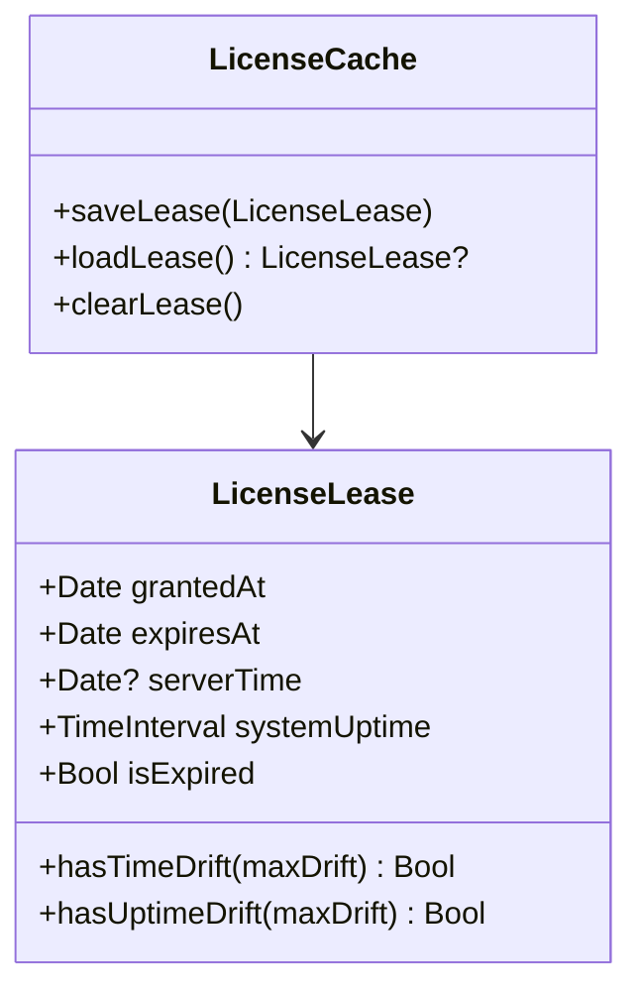

# Phase 01 — Lease Model & Cache

**Parent**: [plan.md](plan.md)
**Date**: 2026-02-14
**Priority**: High
**Implementation Status**: ⬜ Not Started
**Review Status**: ⬜ Pending

## Overview

Create the `LicenseLease` data model and extend `LicenseCache` to persist/load/clear lease records. This is the data foundation for all subsequent phases.

## Key Insights

- Lease is a lightweight `Codable` struct — minimal overhead
- Stored in `UserDefaults` (not Keychain) since it's ephemeral and non-sensitive
- System uptime stored alongside for anti-clock-tamper detection
- `serverTime` from Polar's `lastValidatedAt` anchors time validation

## Requirements

1. `LicenseLease` must be `Codable` and `Equatable`
2. Must store `grantedAt`, `expiresAt`, `serverTime`, and `systemUptime`
3. `isExpired` computed property based on current `Date()`
4. `hasTimeDrift(maxDrift:)` method comparing server time
5. `hasUptimeDrift(maxDrift:)` method comparing system uptime elapsed vs wall clock elapsed
6. `LicenseCache` must save/load/clear lease independently from license data

## Architecture



## Related Code Files

- [LicenseCache.swift](file:///Users/duongductrong/Developer/ZapShot/Snapzy/Core/License/Cache/LicenseCache.swift) — extend
- `Snapzy/Core/License/Models/LicenseLease.swift` — create new

## Implementation Steps

### Step 1: Create `LicenseLease.swift`

```swift
struct LicenseLease: Codable, Equatable {
    let grantedAt: Date
    let expiresAt: Date
    let serverTime: Date?
    let systemUptime: TimeInterval  // ProcessInfo.processInfo.systemUptime at grant time

    var isExpired: Bool { Date() > expiresAt }

    func hasTimeDrift(maxDrift: TimeInterval = 300) -> Bool {
        guard let serverTime else { return false }
        let expectedElapsed = Date().timeIntervalSince(grantedAt)
        let serverElapsed = Date().timeIntervalSince(serverTime)
        return abs(expectedElapsed - serverElapsed) > maxDrift
    }

    func hasUptimeDrift(maxDrift: TimeInterval = 300) -> Bool {
        let currentUptime = ProcessInfo.processInfo.systemUptime
        let uptimeElapsed = currentUptime - systemUptime
        let wallClockElapsed = Date().timeIntervalSince(grantedAt)
        // If wall clock says LESS time passed than uptime, clock was set backward
        return (uptimeElapsed - wallClockElapsed) > maxDrift
    }
}
```

### Step 2: Extend `LicenseCache`

Add 3 methods + 1 constant:

```swift
private let leaseKey = "com.snapzy.license.lease"

func saveLease(_ lease: LicenseLease) {
    if let data = try? JSONEncoder().encode(lease) {
        defaults.set(data, forKey: leaseKey)
    }
}

func loadLease() -> LicenseLease? {
    guard let data = defaults.data(forKey: leaseKey) else { return nil }
    return try? JSONDecoder().decode(LicenseLease.self, from: data)
}

func clearLease() {
    defaults.removeObject(forKey: leaseKey)
}
```

Update `clear()` to also call `clearLease()`.

## Todo

- [ ] Create `LicenseLease.swift` with all properties and methods
- [ ] Add `saveLease`, `loadLease`, `clearLease` to `LicenseCache`
- [ ] Update `LicenseCache.clear()` to also clear lease

## Success Criteria

- `LicenseLease` encodes/decodes correctly
- `isExpired` returns `true` when current time exceeds `expiresAt`
- `hasUptimeDrift` detects backward clock manipulation
- `LicenseCache.clear()` removes lease alongside other data

## Risk Assessment

- **Low** — pure data model, no side effects

## Security Considerations

- System uptime is read-only, unforgeable by user
- Lease stored in `UserDefaults` — acceptable since it's ephemeral (1h TTL)
- Deleting `UserDefaults` only results in forced re-validation (not a bypass)

## Next Steps

→ [Phase 02 — Lease Lifecycle Engine](phase-02-lease-lifecycle-engine.md)
