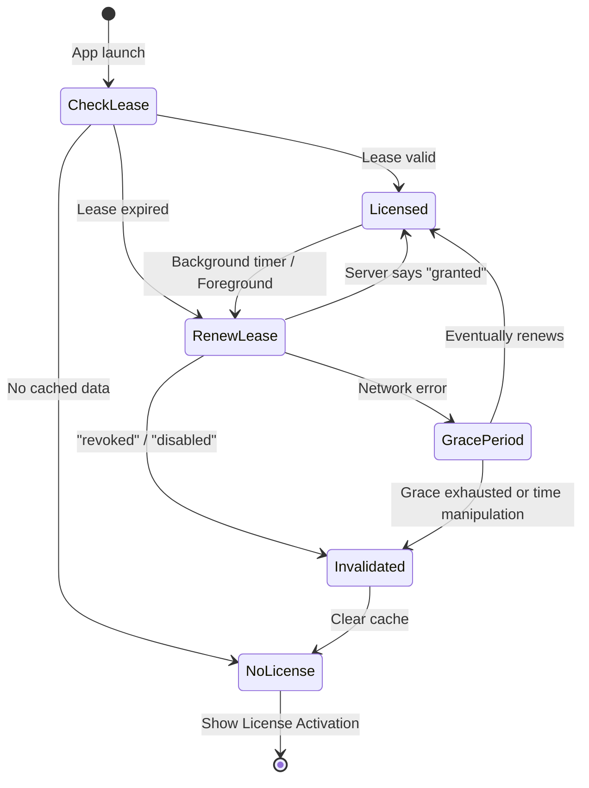

# Phase 02 — Lease Lifecycle Engine

**Parent**: [plan.md](plan.md)
**Dependencies**: [Phase 01](phase-01-lease-model-and-cache.md)
**Date**: 2026-02-14
**Priority**: High (core logic)
**Implementation Status**: ⬜ Not Started
**Review Status**: ⬜ Pending

## Overview

Implement the lease lifecycle in `LicenseManager`: lease-aware startup, hybrid validation, background sync timer, invalidation handler. This is the most complex phase — all the business logic lives here.

## Key Insights

- **Offline-first**: never block user on network call — check local lease first
- **Background sync**: proactive renewal catches revocations within 15 min → good UX
- **Grace period**: existing `TimeValidator` logic is reused, enhanced with uptime check
- **API efficiency**: lease short-circuit means 0 API calls during active use within lease window
- **Rate limit safety**: 4 req/hour << Polar's 3 req/sec limit

## Requirements

1. On app launch: check cached lease → if valid, allow usage instantly (no API call)
2. If lease expired: attempt server renewal → success: new lease; failure: enter grace
3. Background timer: renew lease every 15 min while `.licensed`
4. On `"revoked"` / `"disabled"`: clear cache + lease, post notification, force license screen
5. On network error: apply grace period (existing logic), check for time manipulation
6. On rate limit (429): don't invalidate — extend lease by `Retry-After` value

## Architecture



## Related Code Files

- [LicenseManager.swift](file:///Users/duongductrong/Developer/ZapShot/Snapzy/Core/License/LicenseManager.swift) — major modification

## Implementation Steps

### Step 1: Add new constants and properties

```swift
// Constants
private let leaseDuration: TimeInterval = 3600        // 1 hour
private let backgroundSyncInterval: TimeInterval = 900 // 15 minutes

// Properties
private var syncTimer: Timer?
```

### Step 2: Modify `loadCachedState()` — Lease-Aware Startup

Replace the existing implementation:

```swift
private func loadCachedState() {
    // 1. Check if there's a valid lease (instant, no API call)
    if let lease = cache.loadLease(), !lease.isExpired, cache.load() != nil {
        let cached = cache.load()!
        state = .licensed(license: cached.license)
        startBackgroundSync()
        return
    }

    // 2. Lease expired but cached license exists — allow temporarily, schedule renewal
    if cache.load() != nil {
        let cached = cache.load()!
        state = .licensed(license: cached.license)
        // Immediate async renewal (non-blocking)
        Task { await renewLease() }
        startBackgroundSync()
        return
    }

    // 3. Check trial
    if cache.isTrialStarted() {
        state = checkTrialStatus()
        return
    }

    // 4. No data at all
    state = .noLicense
}
```

### Step 3: Implement `renewLease()` — Core Hybrid Validation

This replaces the need for external callers to use `validateLicense()` directly:

```swift
func renewLease() async {
    guard let orgId = organizationId else {
        state = .noLicense
        return
    }

    // Short-circuit: if lease is still valid, skip the API call
    if let lease = cache.loadLease(), !lease.isExpired {
        return
    }

    isValidating = true
    defer { isValidating = false }

    let localTime = Date()

    // Anti-tamper: check existing lease for clock manipulation
    if let existingLease = cache.loadLease() {
        if existingLease.hasUptimeDrift() {
            handleLicenseInvalidated(reason: .timeManipulationDetected)
            telemetry.track(event: .timeManipulationDetected)
            return
        }
    }

    let licenseKey = cache.getLicenseKey()
    let activationId = cache.getActivationId()

    do {
        let response = try await provider.validate(
            key: licenseKey ?? "",
            organizationId: orgId,
            activationId: activationId
        )

        try cache.saveLicense(response)

        switch response.status {
        case "granted":
            // Create new lease with server time anchor + system uptime
            let lease = LicenseLease(
                grantedAt: localTime,
                expiresAt: localTime.addingTimeInterval(leaseDuration),
                serverTime: response.lastValidatedAt,
                systemUptime: ProcessInfo.processInfo.systemUptime
            )
            cache.saveLease(lease)

            let license = License(from: response)
            state = .licensed(license: license)
            telemetry.track(event: .licenseValidated)
            cache.setLastValidationTime(localTime)
            UserDefaults.standard.set(0, forKey: "grace_count")

        case "revoked":
            handleLicenseInvalidated(reason: .revoked)
            telemetry.track(event: .licenseRevoked)

        case "disabled":
            handleLicenseInvalidated(reason: .licenseDisabled)
            telemetry.track(event: .validationFailed, metadata: ["reason": "license_disabled"])

        default:
            handleLicenseInvalidated(reason: .unknown(response.status))
        }

    } catch {
        // Network error — apply grace period logic
        handleOfflineGracePeriod(localTime: localTime)
    }
}
```

### Step 4: Implement `handleLicenseInvalidated(reason:)`

```swift
private func handleLicenseInvalidated(reason: LicenseState.InvalidReason) {
    try? cache.clear()  // Wipe everything including lease
    state = .noLicense
    stopBackgroundSync()
    NotificationCenter.default.post(name: .licenseInvalidated, object: nil)
}
```

### Step 5: Implement `handleOfflineGracePeriod(localTime:)`

Reuses existing `TimeValidator` + `handleOfflineValidation` logic with lease-awareness:

```swift
private func handleOfflineGracePeriod(localTime: Date) {
    let timeValidation = performTimeValidation(localTime: localTime)

    switch timeValidation {
    case .valid, .gracePeriodAllowed:
        // Allow continued usage with existing cached license
        if let cached = cache.load() {
            state = .licensed(license: cached.license)
            if case .gracePeriodAllowed = timeValidation {
                cache.incrementGraceCount()
                cache.setLastValidationTime(localTime)
                telemetry.track(event: .gracePeriodUsed)
            }
        } else {
            handleLicenseInvalidated(reason: .networkError)
        }

    case .gracePeriodExceeded:
        telemetry.track(event: .gracePeriodExceeded)
        handleLicenseInvalidated(reason: .networkError)

    case .timeManipulationDetected:
        telemetry.track(event: .timeManipulationDetected)
        handleLicenseInvalidated(reason: .timeManipulationDetected)
    }
}
```

### Step 6: Implement background sync timer

```swift
func startBackgroundSync() {
    stopBackgroundSync()
    syncTimer = Timer.scheduledTimer(withTimeInterval: backgroundSyncInterval, repeats: true) { [weak self] _ in
        Task { @MainActor [weak self] in
            await self?.renewLease()
        }
    }
}

func stopBackgroundSync() {
    syncTimer?.invalidate()
    syncTimer = nil
}
```

### Step 7: Wire up existing methods

- `activateLicense()`: after successful activation, create initial lease + call `startBackgroundSync()`
- `deactivateLicense()`: call `stopBackgroundSync()` after clearing
- `clearLicense()`: call `stopBackgroundSync()` after clearing

## Todo

- [ ] Add constants + `syncTimer` property
- [ ] Rewrite `loadCachedState()` with lease-aware logic
- [ ] Implement `renewLease()` with lease creation & status handling
- [ ] Implement `handleLicenseInvalidated(reason:)`
- [ ] Implement `handleOfflineGracePeriod(localTime:)`
- [ ] Implement `startBackgroundSync()` / `stopBackgroundSync()`
- [ ] Wire lease + sync into `activateLicense()`, `deactivateLicense()`, `clearLicense()`

## Success Criteria

- App launches instantly with valid cached lease (no API call)
- Background sync renews lease every 15 min
- Revoked/disabled license → state transitions to `.noLicense` + notification posted
- Network error → grace period allows continued usage (max 2 days / 3 uses)
- Clock manipulation → immediate invalidation
- No API calls during active use within lease window

## Risk Assessment

- **Medium**: Complex state machine — careful integration with existing validation flow
- **Low**: Timer lifecycle — must invalidate on `deactivate` to prevent retain cycles

## Security Considerations

- `renewLease()` short-circuits on valid lease — cannot be abused to spam API
- `handleLicenseInvalidated()` clears ALL data — no way to recover without valid key
- Uptime drift detection is unforgeable on macOS
- Grace period max count resets only on successful server validation

## Next Steps

→ [Phase 03 — App Integration & Enforcement](phase-03-app-integration.md)
